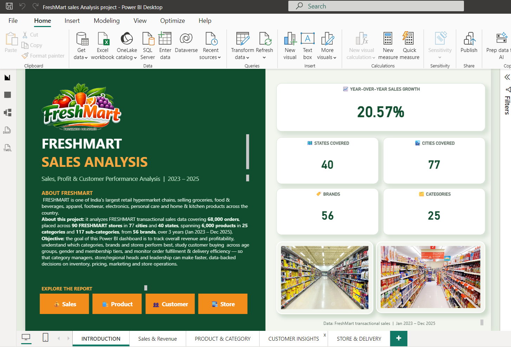
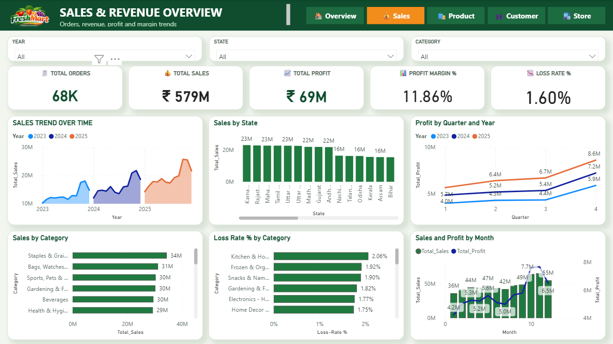
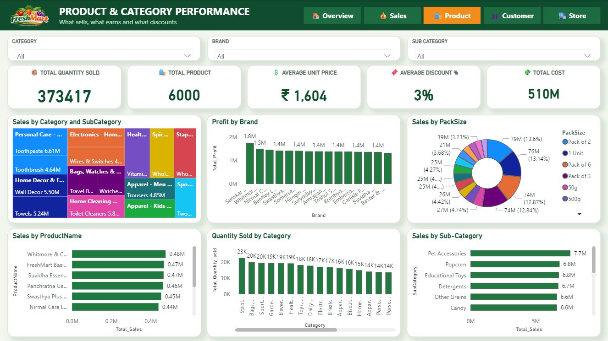
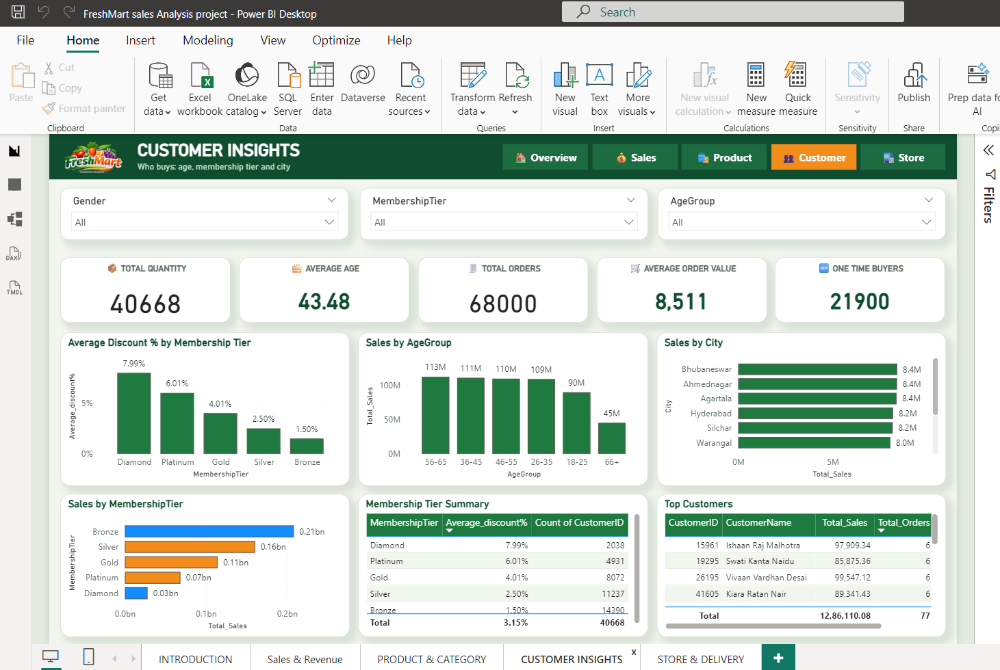
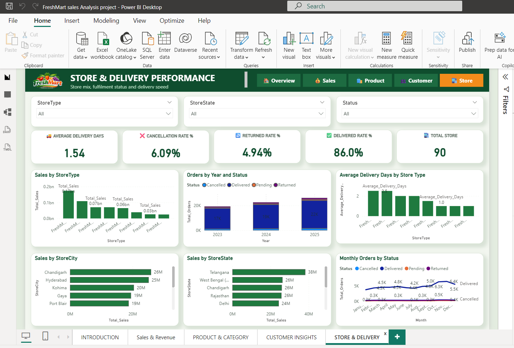

# FreshMart Sales Analysis 📊

A Power BI dashboard project analyzing sales, profit, and customer performance for **FreshMart**, one of India's largest retail hypermarket chains selling groceries, food & beverages, apparel, footwear, electronics, personal care, and home & kitchen products.



## About the Project

This project analyzes FreshMart's transactional sales data covering:

- **5,10,000** orders
- **90** stores across **58 cities** and **40 states**
- **6,000** products across **25 categories** and **117 sub-categories**
- **56** brands
- **3 years** of data (Jan 2023 – Dec 2025)

### Objective

Track overall revenue and profitability, understand which categories, brands, and stores perform best, study customer buying behavior across age groups, gender, and membership tiers, and monitor order fulfillment & delivery efficiency — so category managers, store/regional heads, and leadership can make faster, data-backed decisions on inventory, pricing, marketing, and store operations.

## Dashboard Pages

### 1. Introduction
Project overview with key figures: 20.57% YoY growth, 40 states covered, 56 brands, 25 categories, 77 cities covered.


### 2. Sales & Revenue Overview
Total orders (68K), total sales (₹57.87 Cr), total profit (₹68.66M), profit margin (11.86%), and loss rate (1.60%), broken down by sales trend over time, state, category, and quarter/year.



### 3. Product & Category Performance
Total quantity sold (373,417 units) across 6,000 products, average unit price, average discount %, total cost, and breakdowns by brand, pack size, product name, category, and sub-category.



### 4. Customer Insights
Customer analysis including total quantity, average customer age (43.48), total orders, average order value (₹8.5K), one-time buyers (22K), and breakdowns by membership tier, age group, city, and top customers.



### 5. Store & Delivery Performance
Store and delivery metrics: average delivery days (1.54), cancellation rate (6.09%), returned rate (4.94%), delivered rate (86.0%), total stores (90), with breakdowns by store type, city, state, and order status over time.



## Key Insights

- **20.57% YoY sales growth** across the 2023–2025 period
- **11.86% profit margin** with a low **1.60% loss rate**
- **86% delivery success rate**, with an average delivery time of **1.54 days**
- **Diamond tier members** receive the highest average discount (7.99%) despite being the smallest customer segment
- Sales are led by the **Staples & Groceries**, **Bags & Watches**, and **Sports & Pets** categories

## Tech Stack

- **Power BI Desktop** — data modeling, DAX measures, and interactive report design
- Data model built from transactional order, product, customer, and store tables

## How to Use

1. Clone or download this repository
2. Open `FreshMart_sales_Analysis_project.pbix` in [Power BI Desktop](https://www.microsoft.com/en-us/power-platform/products/power-bi/downloads)
3. Use the filter panels (Year, State, Category, StoreType, etc.) on each page to explore the data interactively

## Repository Structure

```
FreshMart-Sales-Analysis/
├── FreshMart_sales_Analysis_project.pbix
├── screenshots/
│   ├── 01_introduction.png
│   ├── 02_sales_revenue.png
│   ├── 03_product_category.png
│   ├── 04_customer_insights.png
│   └── 05_store_delivery.png
├── README.md
└── LICENSE
```

## License

This project is licensed under the MIT License — see the [LICENSE](LICENSE) file for details.

## Author

Built as a portfolio project to demonstrate Power BI dashboard design, DAX measures, and retail sales analytics.
